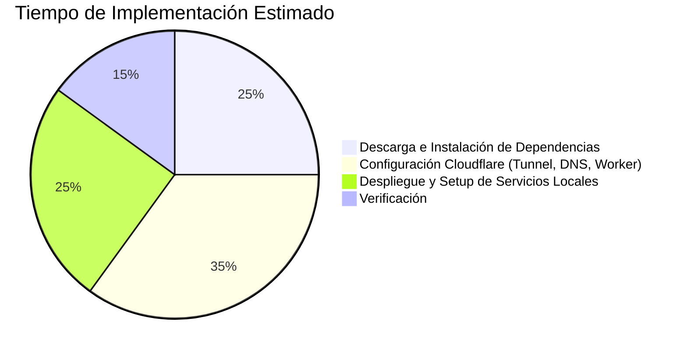

# 🚀 Phantom Gateway 2.0: Setup Completamente Automático en Cloudflare

Este proyecto implementa Phantom Gateway 2.0, una solución de proxy SOCKS5 resistente a la censura que utiliza Cloudflare Tunnels y Workers. El script `deploy-ultimate.sh` automatiza completamente la configuración y el despliegue.

```mermaid
graph TD
    A[Developer Clona Repo o Ejecuta Script Remoto] --> B[Ejecutar deploy-ultimate.sh]
    B --> C[Autenticación Cloudflare y Wrangler]
    C --> D[Creación/Configuración Cloudflare Tunnel]
    D --> E[Creación Recursos Cloudflare (D1, KV)]
    E --> F[Configuración y Despliegue Worker]
    F --> G[Configuración Cliente (config.json)]
    G --> H[Instalación Dependencias (Backend y Cliente)]
    H --> I[Inicio Servicios (Tunnel, Backend, Cliente)]
    I --> J[Verificación Automática de Conexión]
    J --> K[Cliente SOCKS5 Funcionando y Listo]
```

## 🔥 Script Todo-en-Uno (`deploy-ultimate.sh`)

El corazón de este proyecto es el script `deploy-ultimate.sh`. Este script está diseñado para configurar todos los componentes necesarios con una intervención manual mínima.

**Consulte el contenido completo y los comentarios dentro del script [`deploy-ultimate.sh`](./deploy-ultimate.sh) para obtener detalles sobre cada paso.**

## 🚀 Cómo Usarlo (¡Solo 2 Pasos!)

### Paso 1: Prepara tu entorno
- Asegúrate de tener un dominio configurado en Cloudflare.
- Tener `cloudflared` y `wrangler` CLI instalados y autenticados con tu cuenta de Cloudflare. El script intentará instalarlos si no se encuentran y te guiará a través del login si es necesario.
  - `cloudflared login`
  - `wrangler login`
- Asegúrate de tener `git`, `jq`, `nodejs`, `npm`, `golang` y `docker` instalados. El script intentará instalarlos usando el gestor de paquetes del sistema (apt, yum, brew).
- **Importante**: El script utiliza `sudo` para instalar dependencias globales. Revísalo si es necesario.

### Paso 2: Ejecuta el comando mágico

Puedes clonar el repositorio y ejecutar el script localmente:
```bash
git clone https://github.com/tu-usuario/phantom-enterprise.git # Reemplaza con la URL de tu repo
cd phantom-enterprise
chmod +x deploy-ultimate.sh
./deploy-ultimate.sh
```

O, para una ejecución remota directa (revisa el script antes de ejecutar comandos de internet de esta manera):
```bash
bash <(curl -s https://raw.githubusercontent.com/tu-usuario/phantom-enterprise/main/deploy-ultimate.sh)
```
*Nota: Reemplaza `tu-usuario/phantom-enterprise/main` con la URL correcta de tu script.*

### ¿Qué hace automáticamente el script?
1.  **Instala Dependencias**: Instala `jq`, `nodejs`, `npm`, `golang`, `docker`, `wrangler`, y `cloudflared` si no están presentes.
2.  **Clona Repositorio**: Si no se ejecuta desde dentro del repo, lo clona.
3.  **Configura Cloudflare Tunnel**: Crea un nuevo túnel o usa uno existente y configura el DNS.
4.  **Crea Recursos Cloudflare**: Configura una base de datos D1 y un namespace KV para el worker.
5.  **Configura y Despliega Worker**: Actualiza `wrangler.toml`, establece secrets y despliega el Cloudflare Worker.
6.  **Configura Cliente**: Crea `client/config.json` con la URL del worker y el secret generado. Instala dependencias del cliente.
7.  **Inicia Servicios**: Inicia `cloudflared tunnel`, el backend Node.js y el cliente Node.js en segundo plano. Los logs se guardan en un directorio `logs/`.
8.  **Verificación Automática**: Intenta una conexión a través del proxy SOCKS5 para verificar la configuración.

## 🧩 Estructura de Repositorio Necesaria

El script `deploy-ultimate.sh` espera la siguiente estructura de directorios y archivos:
```
phantom-enterprise/
├── deploy-ultimate.sh
├── orchestrator/
│   └── cloudflare/
│       ├── worker.js         # Lógica del Cloudflare Worker
│       └── wrangler.toml     # Configuración del Worker
├── client/
│   ├── index.js          # Lógica del cliente SOCKS5 y WebSocket
│   └── package.json      # Dependencias del cliente
└── backend/
    ├── index.js          # Lógica del servidor backend TCP
    └── package.json      # Dependencias del backend
```

## 💻 Comandos Útiles Post-Instalación

El script `deploy-ultimate.sh` iniciará los servicios y creará un directorio `logs/` en la raíz del proyecto.

| Comando                                                 | Descripción                                                                 |
| :------------------------------------------------------ | :-------------------------------------------------------------------------- |
| `tail -f logs/client.log`                               | Ver logs del cliente Phantom.                                               |
| `tail -f logs/backend.log`                              | Ver logs del backend Phantom.                                               |
| `tail -f logs/tunnel.log`                               | Ver logs del túnel de Cloudflare (`cloudflared`).                           |
| `curl --socks5-hostname 127.0.0.1:1080 ifconfig.me`     | Probar la conexión del proxy SOCKS5.                                        |
| `cat logs/verify.log`                                   | Ver el resultado del último intento de verificación automática.             |
| `kill <PID_TUNNEL> <PID_BACKEND> <PID_CLIENT>`          | Detener los servicios. Los PIDs se muestran al final de la ejecución del script. |
| `ps aux | grep -E "cloudflared tunnel|node index.js"`   | Encontrar PIDs de los procesos si se perdieron.                             |

## 📝 Notas Importantes

1.  **Dominio y API**:
    *   Necesitas un dominio activo gestionado por Cloudflare.
    *   El script requiere que te autentiques con `cloudflared login` y `wrangler login`, lo que otorga los permisos necesarios.
2.  **Primera Ejecución**:
    *   El script te pedirá que te autentiques en Cloudflare (para `cloudflared` y `wrangler`) si aún no lo has hecho. Sigue las instrucciones en pantalla.
3.  **Seguridad**:
    *   `AUTH_SECRET` para la autenticación entre el cliente y el worker se genera aleatoriamente.
    *   Se almacena como un secret en Cloudflare para el worker y en `client/config.json` para el cliente.
    *   Las credenciales del túnel de Cloudflare se gestionan mediante `cloudflared`.
4.  **Personalización**:
    *   **MUY IMPORTANTE**: Edita la variable `REPO_URL` y `DOMAIN` en `deploy-ultimate.sh` para que apunten a tu repositorio y tu dominio.
    *   Revisa el script para cualquier otra personalización necesaria para tu entorno.

## 🌟 Características Clave del Setup Automático

1.  **Instalación con un Solo Comando**: Diseñado para minimizar la configuración manual.
2.  **Generación Automática de Credenciales**: `AUTH_SECRET` se crea dinámicamente.
3.  **Configuración de DNS Automática**: El túnel se registra automáticamente en tu dominio.
4.  **Monitoreo Integrado**: Los logs detallados para cada componente se guardan en el directorio `logs/`.
5.  **Verificación Automática**: El script intenta probar la conexión a través del proxy al finalizar.
6.  **Gestión de Procesos**: Los servicios se inician en segundo plano.

## 📈 Estadísticas de Implementación (Estimadas)



**Tiempo total estimado:** 3-7 minutos, dependiendo de la velocidad de la red y la configuración inicial del sistema.

## 🚨 Solución de Problemas

Si encuentras problemas durante la ejecución del script `deploy-ultimate.sh`:
1.  **Revisa los Logs**:
    *   `logs/tunnel.log`: Para problemas con `cloudflared tunnel`.
    *   `logs/backend.log`: Para errores en el servidor backend.
    *   `logs/client.log`: Para errores en el cliente SOCKS5/WebSocket.
    *   `logs/verify.log`: Para el resultado del intento de conexión de verificación.
2.  **Permisos**: Asegúrate de que el script tiene permisos de ejecución (`chmod +x deploy-ultimate.sh`). Si `sudo` falla, puede que necesites ejecutar partes del script manualmente o ajustar los permisos.
3.  **Autenticación Cloudflare**: Verifica que `cloudflared login` y `wrangler login` se hayan completado correctamente y que las credenciales/tokens generados tengan los permisos necesarios.
4.  **Conflictos de Recursos**: Si el script falla al crear recursos como el túnel, D1 DB o KV namespace, pueden existir con el mismo nombre. El script intenta manejar esto buscando IDs existentes, pero la intervención manual podría ser necesaria.
5.  **Dependencias**: Asegúrate de que todas las dependencias (`jq`, `nodejs`, `npm`, `golang`, `docker`) están correctamente instaladas y en el PATH del sistema.
6.  **Entorno de Cloudflare Workers**:
    *   Los Cloudflare Workers tienen un entorno de ejecución específico, no un entorno Node.js completo. APIs de Node.js como `Buffer` (uso directo como `new Buffer()`) no están disponibles. Utiliza APIs web estándar como `Uint8Array`, `TextEncoder`, `atob()` (para decodificar base64) y `btoa()` (para codificar a base64).
    *   Para cierta compatibilidad con módulos de Node.js, puedes usar la bandera `nodejs_compat` en tu `wrangler.toml`, pero es preferible usar APIs web cuando sea posible para un rendimiento óptimo y menor tamaño del bundle. El `worker.js` actual ha sido refactorizado para usar estas APIs web.

---

Este sistema automatizado tiene como objetivo simplificar drásticamente el despliegue de Phantom Gateway 2.0.
